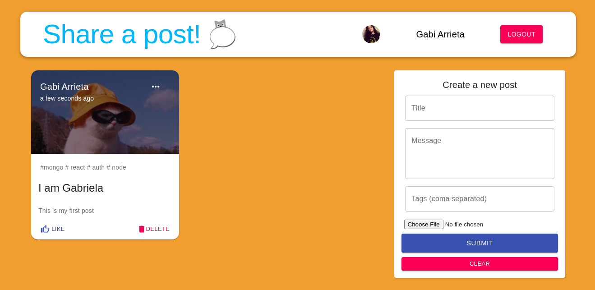
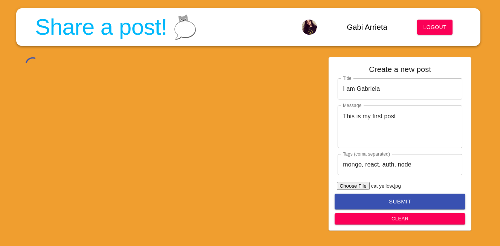
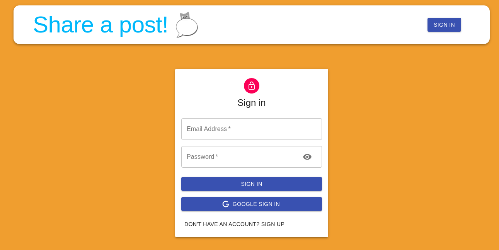

# Share a post - Social App

## Mern application

App developed using React, Node.js, Express & MongoDB 



The App is a simple social media app that allows users to post and share publications with other people,
and it has authentication with google.



## Features:
- sign in and sign up
- login with google
- make a post, like other's people posts and update your own



## Deploy on Heroku: https://app-mongo-0auth.herokuapp.com/

Setup:
- run ```npm i && npm start``` for both client and server side to start the app
